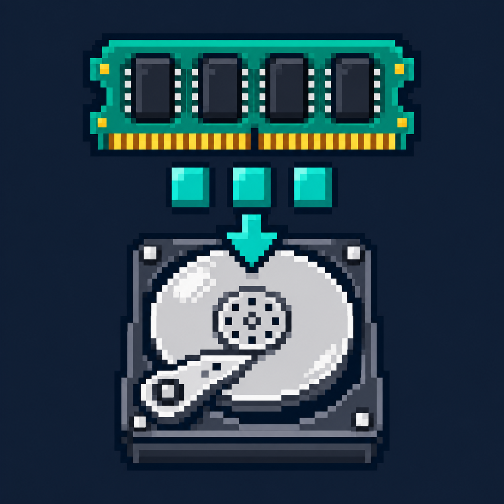
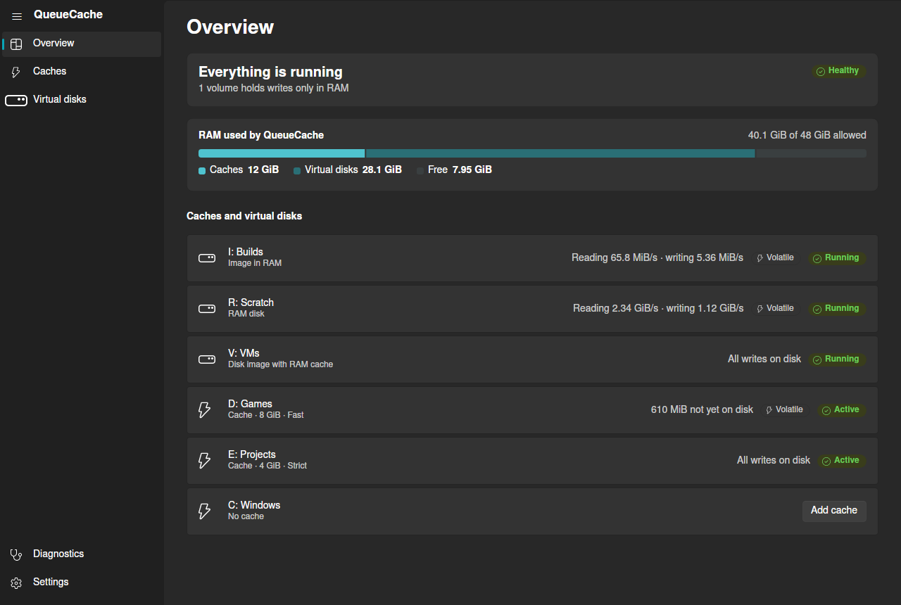
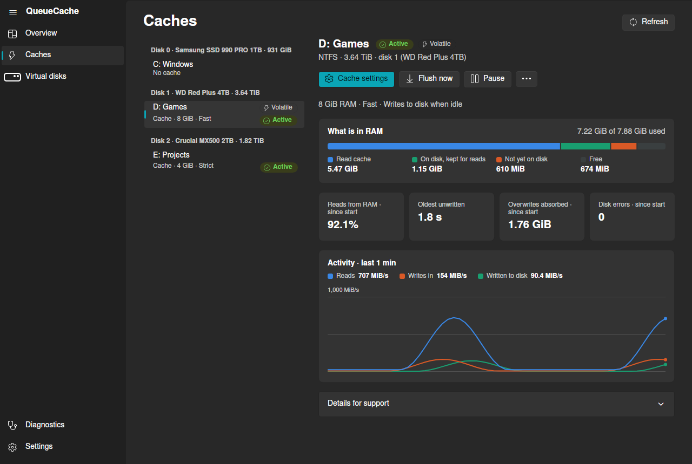
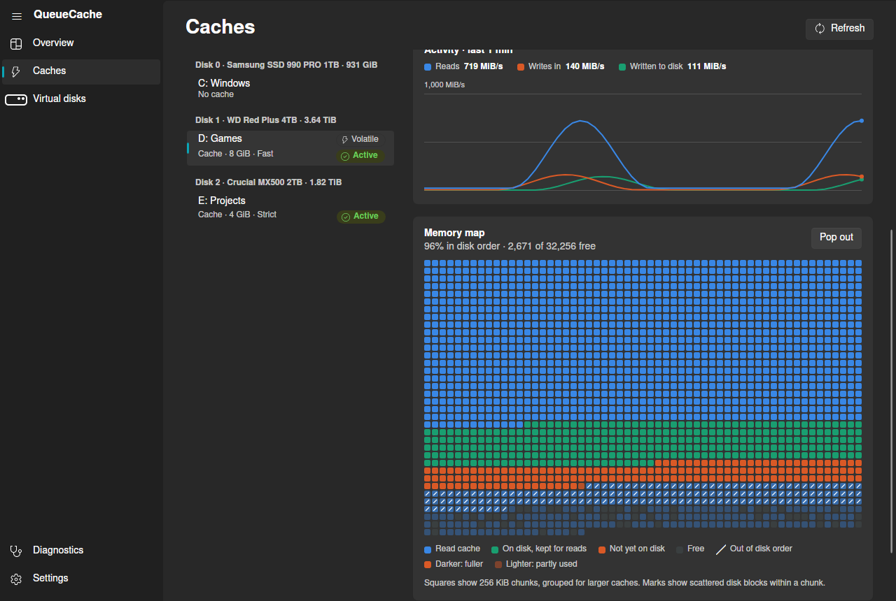
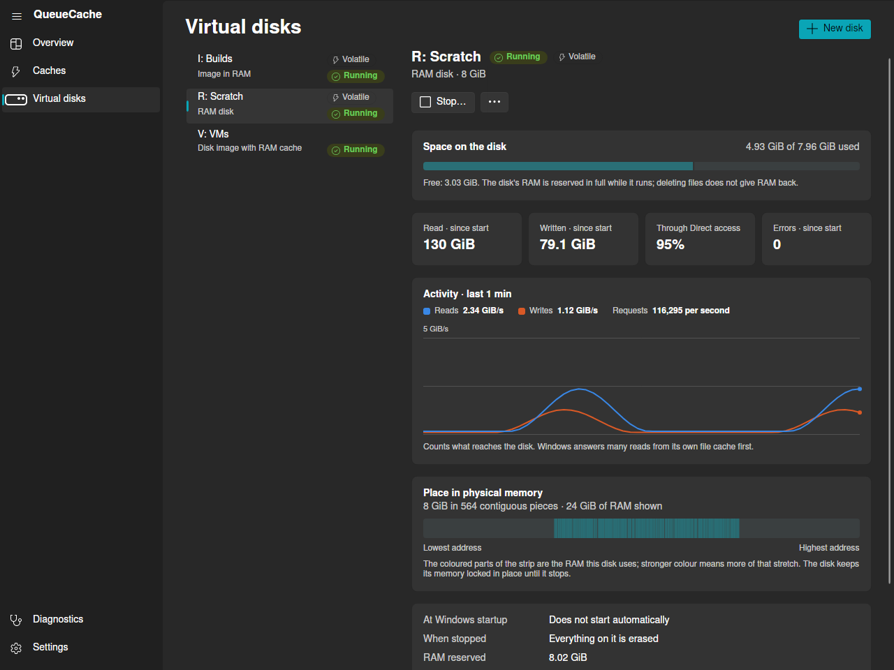
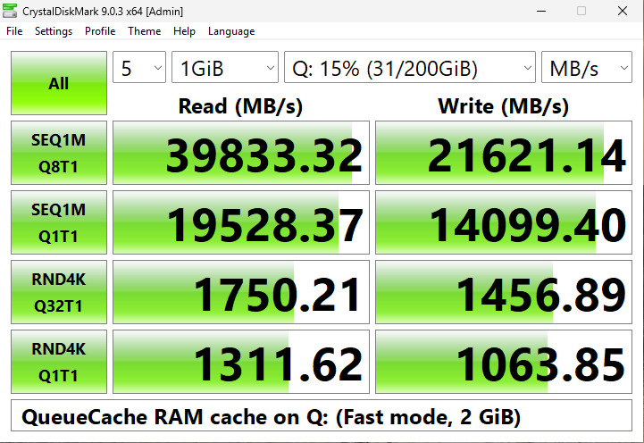
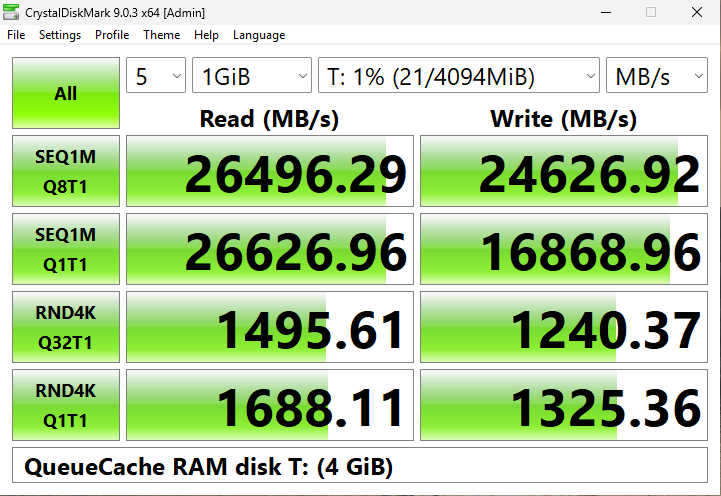
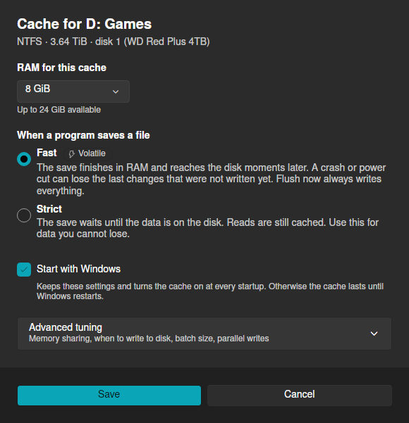
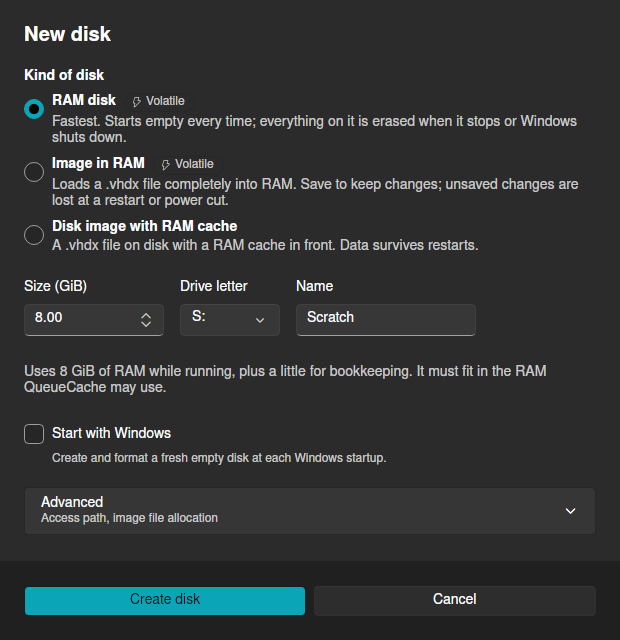

<p align="center">
  
</p>

<h1 align="center">QueueCache</h1>

<p align="center">
  <b>RAM caching and RAM disks for Windows.</b><br>
  Make slow drives feel fast, or create disks that live entirely in memory.
</p>

<p align="center">
  <a href="https://github.com/devedse/QueueCache/releases">Download</a> ·
  <a href="#caching-a-drive">Caching</a> ·
  <a href="#ram-disks">RAM disks</a> ·
  <a href="#performance">Performance</a> ·
  <a href="#before-you-use-it">Before you use it</a>
</p>



## What it does

QueueCache puts spare RAM to work in two ways:

- **Cache a drive.** Recently used files and new writes are kept in RAM in front
  of any drive: a hard disk, an SSD or a network disk. Reads come from RAM, and
  saving a file can finish at RAM speed while QueueCache writes it to the disk
  in the background.
- **Create disks in RAM.** A RAM disk for scratch files, a disk image loaded
  completely into RAM, or a disk image file with a RAM cache in front.

One app shows everything: what is in RAM, what is not yet on disk, and live
activity. It sits in the notification area and starts when you sign in.

## Caching a drive

Choose a drive, how much RAM it may use, and how saving a file should behave:

| Mode | When a program saves a file | Good for |
|---|---|---|
| **Fast** | The save finishes in RAM; QueueCache writes it to the disk moments later. | Games, build output, downloads: anything you can get back |
| **Strict** | The save waits until the data is on the disk. Reads still come from RAM. | Documents and anything you cannot lose |

Each drive letter gets its own cache (NTFS, ReFS, FAT32 and exFAT). With
**Start with Windows**, the cache comes back after every restart.



The **memory map** shows how the cache's RAM is used, like a disk defragmenter:
one square per 256 KiB, coloured by what it holds, with a mark where data is out of
disk order. QueueCache places new data in disk order so it reads back fastest.



## RAM disks

Create one from **Virtual disks → New disk**:

| Kind | What it is | When it stops |
|---|---|---|
| **RAM disk** | An empty disk in RAM. The fastest option. | Everything on it is erased. |
| **Image in RAM** | A `.vhdx` disk image loaded completely into RAM. **Save** copies it back. | It saves first (you can choose to discard instead). |
| **Disk image with RAM cache** | A `.vhdx` file that stays on disk, with a RAM cache in front. | Pending writes go to the file first; the data stays in the file. |

Any of them can start with Windows. After a crash or power cut, a RAM disk is
empty and an image in RAM is back at its last save.



A running RAM disk or image in RAM also shows where its memory sits in the
machine's physical RAM.

## Performance

[CrystalDiskMark](https://crystalmark.info/en/software/crystaldiskmark/) 9.0.3,
default test (1 GiB, 5 passes); with QueueCache, the best of two runs.

| Test machine | |
|---|---|
| Host | AMD Ryzen 9 9955HX (16 cores), Proxmox VE 9.2 |
| Virtual machine | Windows 11 Pro, 4 vCPUs, 16 GB RAM |
| Drive Q: | 200 GB virtual SSD on Ceph network storage |

<p align="center">
  
  
</p>

| MB/s | Q: without cache | Q: with 2 GiB Fast cache | 4 GiB RAM disk |
|---|---:|---:|---:|
| Sequential read (SEQ1M Q8T1) | 629 | 39,833 | 26,496 |
| Sequential write (SEQ1M Q8T1) | 245 | 21,621 | 24,627 |
| Random 4K read (RND4K Q1T1) | 19.5 | 1,312 | 1,688 |
| Random 4K write (RND4K Q1T1) | 4.8 | 1,064 | 1,325 |

The test file fits in RAM, so this shows what QueueCache does for data that is
in its cache. Work larger than the cache runs at the drive's own speed.
[How these were measured](docs/BENCHMARKING.md).

## Getting started

1. Download the installer from the [latest release](https://github.com/devedse/QueueCache/releases)
   and run it.
2. Restart Windows.
3. QueueCache starts in the notification area. Open it, then:
   - **Caches** → choose a drive → **Add cache**, or
   - **Virtual disks** → **New disk**.

<p align="center">
  
  
</p>

To update, stop any running virtual disks, then run **Update QueueCache** on the
desktop. Everything in the app is
also available from an administrator terminal:

```powershell
qcache volume list
qcache policy apply D: --budget-mib 4096 --accept-volatile-flush --save   # Fast cache, 4 GiB
qcache disk create --mode ram --size-mib 8192 --letter R                  # 8 GiB RAM disk
```

## Before you use it

QueueCache is young and not battle-tested. It runs as a driver in Windows'
storage stack, so a bug can crash Windows or damage data. In Fast mode and on
RAM disks, data that is only in RAM is lost when Windows crashes or the power
fails. Keep backups, start with data you can afford to lose, and use it at your
own risk.

## For developers

Building, the command line in full, the verification runner and the design
documents: see [docs/DEVELOPMENT.md](docs/DEVELOPMENT.md).

QueueCache is released under the [MIT License](LICENSE).
