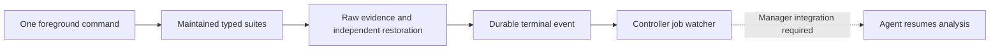

# Single-command performance verification and completion delivery

Status: typed campaigns, sequential execution, combined reports and durable
completion events are implemented in plan 114. Windows/VM qualification is recorded
separately in the [tracker](RAM_FIRST_IMPLEMENTATION_TRACKER.md). Automatic Manager
wakeup remains an external integration. `full` does not include every specialized
performance suite or the separate write matrix. Findings and priorities are in
[PERFORMANCE_FINDINGS.md](PERFORMANCE_FINDINGS.md).

## Intended operator experience

Run one foreground command with explicit targets and an immutable campaign plan.
For example:

```powershell
qcache developer verify Q: --campaign performance --lab-ntfs W: --lab-refs R: --diskspd C:\Tools\DiskSpd\diskspd.exe --pause-backing-cache --output C:\QueueCache-Results
```

Selecting a campaign is mutually exclusive with selecting a single suite. No `--detach`, new
benchmark executable, installer or private PowerShell scenario loop is needed.
The CLI binds arguments; typed orchestration owns phases, cases and evidence.
Existing single-suite commands remain available for focused regressions.

Launch the foreground process through the controlling application's job
mechanism. Keep its process/session identity and stream its normal progress/log.
The controller receives process completion once and then reads the exact campaign
report. The agent need not wake every five minutes to ask whether a file exists.
Long runs retain human-readable progress without requiring an agent turn per
progress line.



## Typed profiles and safe targets

| Profile | Phases | Scope |
|---|---|---|
| `smoke` | Two maintained NTFS cases: `quick`, `partial-read-accounting` | Short real-run orchestration check, no DiskSpd needed. |
| `focused` | `--focus-suite` plus partial-read, paging, policy, pressure and final ordering/fault checks | Only the named affected measurement suite; optional ReFS only for caller-backoff. |
| `performance` | Retained correctness; cache layout; RAM reference and scheduling controls; NTFS/optional ReFS caller; priority; recall; 120-second sustained accounting; map cost; ordering/faults last | Thirteen phases / 118 outer cases without ReFS at defaults; fourteen / 142 with ReFS. The short sustained phase is a smoke, not 30-minute acceptance. No retired queue, disk-removal or write matrix. |
| `release-performance` | Performance plus `write-performance`; sustained default 1800 seconds | Fourteen phases / 190 outer cases without ReFS; fifteen / 214 with ReFS. Write suite has 72 cases at three repeats. GUI CrystalDiskMark/README tasks remain separate. |

Campaign budgets default to 2048 MiB; repetitions/duration remain explicit and
are forwarded to maintained factories. `cache-sustained` always has one repetition;
`--soak-seconds` overrides its profile default. Counts describe outer runner cases,
not the separate inner correctness checks or RAM windows. At three repetitions,
RAM reference/scheduling phases contain 36/30 guarded measurement windows.

For an affected RAM-read regression:

```powershell
qcache developer verify Q: --campaign focused --focus-suite ram-read-scheduling --lab-ntfs W: --diskspd C:\Tools\DiskSpd\diskspd.exe --pause-backing-cache --output C:\QueueCache-Results
```

Targets must already be attached and prepared. Lab roles require the supported
developer VHDX layout, matching filesystem/labels, native identity, clean state
and observed loaded-driver filenames/hashes. Campaign preflight rejects running
benchmark/Desktop processes and below-normal launches. If a lab image is on the
active performance volume, `--pause-backing-cache` explicitly permits a runtime
pause and independent restoration. An active different backing cache is refused.
The campaign owns all target disk leases between phases. It never creates or
formats a lab disk automatically.

Every phase declares a target role, filesystem, budget, repetitions, score and
warmup durations, expected cases, failure policy, driver feature requirements and
restoration deadline. Resolve roles to exact volume IDs and owned lab registrations
before running. Refuse OS volumes or wrong targets for lab-only scenarios. Do not
create/format a disk silently. ReFS caller tests require the supported owned lab;
fault injection stays on the NTFS lab. Cache pausing on a lab's backing volume must
be explicit, captured and restored, with saved profiles unchanged.

Freeze the resolved plan and options in a campaign manifest before the first
measurement. Changes to workload/measurement contracts increment the verification
plan version. A campaign has one immutable namespace; each phase retains its own
normal run artifacts and independently unique case IDs. A summary indexes those
exact children rather than searching historical folders. Phase counts and results
must agree with the frozen manifest before overall completion.

## Implemented runner behavior

1. Add typed campaign/profile/phase records beside `VerificationPlan`,
   `CacheExercisePlan` and `RamReadReferencePlan`. Reuse their scenario factories;
   do not copy scenario logic into CLI handlers or shell scripts.
2. Add a campaign coordinator around the existing `VerificationRunner` execution
   seam. Keep one ownership boundary, no concurrent benchmark phases, and retain
   each phase's provenance, expected-case list, progress, worker journal,
   readiness/coverage and raw results. Prevent unrelated test/UI work at preflight.
3. Capture original runtime state once and independently restore after each phase.
   Validate restoration before advancing. Faulted restoration stops the campaign;
   transient draining and a driver fault remain different states. Run injected
   fault scenarios last if selected. Never reboot/format or kill unowned processes
   as recovery. Preserve `verify-recover` identity/live-process refusal behavior.
4. Write atomic campaign status after case progress and each phase. Child
   `timing.json` records preflight, common preparation, cases, restoration and
   finalization; case time includes its warmup/draining and is not scored time.
   Campaign phase elapsed includes backing maintenance. Unknown evidence counts
   stay null; no invented progress percentages.
5. Produce campaign `SUMMARY.md`, machine-readable results, failed-phase location
   and restoration outcome. Performance verdicts use predetermined comparisons
   and controls, separate from collection status. An incomplete phase cannot pass
   by combining another run's repetitions or treating missing counters as zero.
6. Finalize reports and owned-process cleanup/restoration, then atomically write
   the completion marker and a versioned completion event. A failed measurement
   still produces a terminal event with failure and restoration outcomes;
   interrupted runs with no marker remain interrupted/running.

No change to strict zero-lower-I/O controls, two-second maximum telemetry gaps,
native identity validation, priority readbacks or per-operation timeouts is part
of this plan. There is no overall deadline by default; restoration retains its
own deadline.

## Completion-driven agent notification

The runner writes a durable local event containing campaign/run ID,
manifest digest, exact output path, terminal status, expected/completed counts,
failure and restoration outcome. It should not hold manager credentials or send
arbitrary external messages. A controller-owned job watcher can wait on the
foreground process exit and consume that event; reconnecting controllers can
recover unsent events from a durable outbox. Deduplicate by campaign ID and
terminal-event ID. Deliver only after terminal evidence is committed.

After `FINISHED.txt`, finalized status/reports and owned cleanup, `completion.json`
is published last. It also covers failures/cancellation, with restoration outcome.
`completion-delivery.json` starts as `PENDING_CONTROLLER`; this is not a claim
that a notification was delivered. `verify-status` reads campaign progress.

```powershell
qcache developer verify-completion C:\QueueCache-Results\QueueCache-Campaign-<run-id>
```

This read-only command validates the manifest digest, terminal counts, required
reports and marker before returning the event as JSON. The event identity is
stable across reads, so the controller can deduplicate retries. It has no Manager
credentials or arbitrary callback command. For failed runs, inspect the indexed
child/maintenance directory; `verify-recover` still applies to a recorded child
run, not to restarting or recombining a campaign.

The current exposed `dam-tools` command only supports sharing images; no
completion notification or agent wake API is available here. Automatic awakening
therefore needs an explicit DeveAgentManager job/completion integration, or an
existing controller process-completion feature verified by its owner. Do not
claim this integration already exists. Until it does, stream/await one owned
foreground process and inspect its completion once; use manual status only for
operator requests or diagnosing stalls. A watcher should be event-driven, not an
agent repeatedly opening SSH sessions.

Distinguish run completion from notification delivery. Delivery failure does not
change a measurement verdict or rerun benchmarks. Record delivery separately and
retry only the controller event with bounded backoff/deduplication. Never include
credentials, private VM connection data or raw secrets in the event.

## Verification and rollout

| Step | Required checks | Deliverable |
|---|---|---|
| Typed campaign and coordinator | Host contracts for deterministic counts/IDs, suite and target selection, sequential phases, forwarded options, stop-on-failure, no next phase after restoration failure, exact child evidence indexing | One supported command with honest campaign status and summaries. |
| Durable terminal event | Host contracts for finalize-before-event ordering, failure events, interrupted runs, duplicate delivery and reconnect recovery; preserve synchronous console errors/progress | Process completion can be consumed once without polling by the agent. |
| Manager integration | Verify a supported job callback/wake contract; controller owns authentication and persistent mapping to the conversation/job | Agent receives one terminal result and resumes analysis. This dependency is external to the repo runner. |
| VM smoke | Two short maintained phases on owned NTFS lab; actual native identity, immutable evidence, process ownership and exact restoration | Validate orchestration, not a broad performance acceptance matrix. |
| First full campaign | Freeze profile/options, run once on the normal-priority quiet VM, inspect every phase and final restoration | Establish campaign reference and document elapsed phase times and result-driven next steps. |

The coordinator/event implementation is in this PR. Manager delivery/reconnect
outbox handling is a future controller task, determined by its supported API.
Use the short smoke and focused checks to qualify orchestration; a broad matrix
is not needed merely to validate reporting/notification plumbing. A first release profile's
benchmark time includes about 54 minutes for the current write matrix and at
least 30 minutes of sustained mixed I/O, before other phases/preparation/drains.
